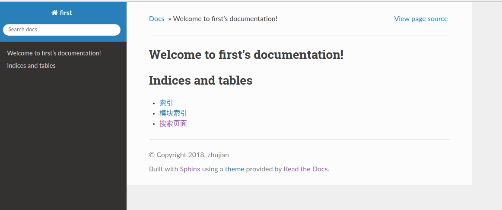

# html主题修改

## 内置主题

sphinx提供了多种内置主题，当前默认主题是alabaster，还有其他的主题 - [builtin-themes](http://www.sphinx-doc.org/en/master/usage/theming.html#builtin-themes)

## 修改

修改conf.py中的html_theme

    # The theme to use for HTML and HTML Help pages.  See the documentation for
    # a list of builtin themes.
    #
    html_theme = 'sphinx_rtd_theme'

我修改成了readthedocs主题风格，它需要先自行安装

    pip install sphinx_rtd_theme

## 自定义

sphinx也支持自定义主题，或者对当前主题进行微调 - [using-a-theme](http://www.sphinx-doc.org/en/master/usage/theming.html#using-a-theme)
