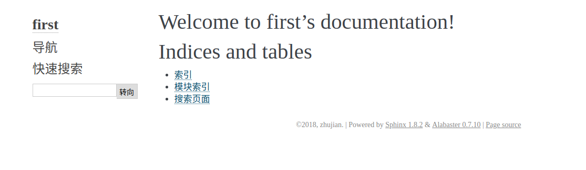

# 快速生成文档工程

参考：[Getting Started](http://www.sphinx-doc.org/en/master/usage/quickstart.html)

`sphinx`提供了工具`sphinx-quickstart`用于快速生成一个文档工程

---

## `sphinx-quickstart`使用

新建空文件夹，该目录下，输入命令`sphinx-quickstart`启动一个工程，随后根据需求选择配置

    zhujian@zhujian-virtual-machine:~/doc/first$ sphinx-quickstart 
    Welcome to the Sphinx 1.8.2 quickstart utility.

    Please enter values for the following settings (just press Enter to
    accept a default value, if one is given in brackets).

    Selected root path: .

    You have two options for placing the build directory for Sphinx output.
    Either, you use a directory "_build" within the root path, or you separate
    "source" and "build" directories within the root path.
    > Separate source and build directories (y/n) [n]: 

默认以当前目录作为根目录，默认将根目录作为源文件路径

可以设置将源文件和输出文件放置在两个不同文件夹内

    Inside the root directory, two more directories will be created; "_templates"
    for custom HTML templates and "_static" for custom stylesheets and other static
    files. You can enter another prefix (such as ".") to replace the underscore.
    > Name prefix for templates and static dir [_]: 

在源文件目录中会生成两个文件夹：`'_templates'`用于保存自定义HTML模板；`‘_static’`用于保存自定义样式表和其他静态文件，默认以下划线`'_'`来强调文件夹功能

    The project name will occur in several places in the built documentation.
    > Project name: 
    > Author name(s):
    > Project release []: 

输入工程名、作者名、版本号

    If the documents are to be written in a language other than English,
    you can select a language here by its language code. Sphinx will then
    translate text that it generates into that language.

    For a list of supported codes, see
    http://sphinx-doc.org/config.html#confval-language.
    > Project language [en]: 

语言定制，默认是英语，中文是`zh_CN`

    The file name suffix for source files. Commonly, this is either ".txt"
    or ".rst".  Only files with this suffix are considered documents.
    > Source file suffix [.rst]: 

指定源文件后缀名，默认为`'.txt'`或者`'.rst'`，仅有指定后缀的文件会被加入文档

    One document is special in that it is considered the top node of the
    "contents tree", that is, it is the root of the hierarchical structure
    of the documents. Normally, this is "index", but if your "index"
    document is a custom template, you can also set this to another filename.
    > Name of your master document (without suffix) [index]: 

指定名为`'index'`的文件为内容树的顶部节点，如果名为`'index'`的文件已被用于自定义模板，那么可以指定另外一个文件名作为顶部节点

    Indicate which of the following Sphinx extensions should be enabled:
    > autodoc: automatically insert docstrings from modules (y/n) [n]: y
    > doctest: automatically test code snippets in doctest blocks (y/n) [n]: y
    > intersphinx: link between Sphinx documentation of different projects (y/n) [n]: y
    > todo: write "todo" entries that can be shown or hidden on build (y/n) [n]: y
    > coverage: checks for documentation coverage (y/n) [n]: y
    > imgmath: include math, rendered as PNG or SVG images (y/n) [n]: y
    > mathjax: include math, rendered in the browser by MathJax (y/n) [n]: y
    > ifconfig: conditional inclusion of content based on config values (y/n) [n]: y> viewcode: include links to the source code of documented Python objects (y/n) [n]: y
    > githubpages: create .nojekyll file to publish the document on GitHub pages (y/n) [n]: y
    Note: imgmath and mathjax cannot be enabled at the same time. imgmath has been deselected.

指定下列扩展功能是否使用

1. `autodoc`: 自动从模块中插入文档字符串
2. `doctest`: 自动测试文档测试块中的代码片段
3. `intersphinx`: 链接不同工程中的`sphinx`文档
4. `todo`: 是否在构建时显示或隐藏`'todo'`条目
5. `coverage`: 检查文档覆盖率
6. `imgmath`: 将数学公式渲染为`PNG`或`SVG`图像
7. `mathjax`: 在浏览器中用`MathJax`渲染数学公式
8. `ifconfig`: `conditional inclusion of content based on config values`
9. `viewcode`: 文档化`Python`对象源代码的包含链接
10. `githubpages`: 创建一个`.nojekyll`文件，以便发布到`github`

需要注意的是，不能同时配置`imgmath`和`mathjax`

    A Makefile and a Windows command file can be generated for you so that you
    only have to run e.g. `make html' instead of invoking sphinx-build
    directly.
    > Create Makefile? (y/n) [y]: 
    > Create Windows command file? (y/n) [y]:

是否生成一个`Makefile`文件和一个`Windows`命令文件，这样可以直接生成而不需要使用工具`sphinx-build`

    Creating file ./conf.py.
    Creating file ./index.rst.
    Creating file ./Makefile.
    Creating file ./make.bat.

    Finished: An initial directory structure has been created.

    You should now populate your master file ./index.rst and create other documentation
    source files. Use the Makefile to build the docs, like so:
    make builder
    where "builder" is one of the supported builders, e.g. html, latex or linkcheck.

配置完成了

---

## 工程结构

默认源文件和生成文件放在一起

    zhujian@zhujian-virtual-machine:~/doc/first$ ls
    _build  conf.py  index.rst  make.bat  Makefile  _static  _templates
    zhujian@zhujian-virtual-machine:~/doc/first$ tree
    .
    ├── _build
    ├── conf.py
    ├── index.rst
    ├── make.bat
    ├── Makefile
    ├── _static
    └── _templates

    3 directories, 4 files

如果将源文件和生成文件配置成两个文件夹

    zhujian@zhujian-virtual-machine:~/doc/sphinx$ ls
    build  make.bat  Makefile  source
    zhujian@zhujian-virtual-machine:~/doc/sphinx$ tree
    .
    ├── build
    ├── make.bat
    ├── Makefile
    └── source
        ├── conf.py
        ├── index.rst
        ├── _static
        └── _templates

    4 directories, 4 files

`build`(或`_build`)是输出文件路径

`Makefile/make.bat`是构建文件

`source`是源文件路径(在文件`conf.py`中包含了所有的配置选项)

---

## 构建

如果已经生成了`Makefile`文件，那么直接使用`make`命令就好了

    make builder 
    
`builder`指要构建的格式，比如`html,latex`等等

    zhujian@zhujian-virtual-machine:~/doc/sphinx$ make html
    Running Sphinx v1.8.2
    making output directory...
    building [mo]: targets for 0 po files that are out of date
    building [html]: targets for 1 source files that are out of date
    updating environment: 1 added, 0 changed, 0 removed
    reading sources... [100%] index                                                 
    looking for now-outdated files... none found
    pickling environment... done
    checking consistency... done
    preparing documents... done
    writing output... [100%] index                                                  
    generating indices... genindex
    writing additional pages... search
    copying static files... done
    copying extra files... done
    dumping search index in English (code: en) ... done
    dumping object inventory... done
    build succeeded.

    The HTML pages are in build/html.

然后进入`./build/html`，打开`index.html`即可

如果源文件和输出文件放置在一起，那么输出会在`_build`文件夹内

    zhujian@zhujian-virtual-machine:~/doc/first$ make html
    Running Sphinx v1.8.2
    ...

    The HTML pages are in _build/html.

也可以使用工具`sphinx-build`，操作如下：

    sphinx-build -b html sourcedir builddir

`sourcedir`指定源文件路径，`builddir`指定输出文件路径，`-b html`指定输出格式
